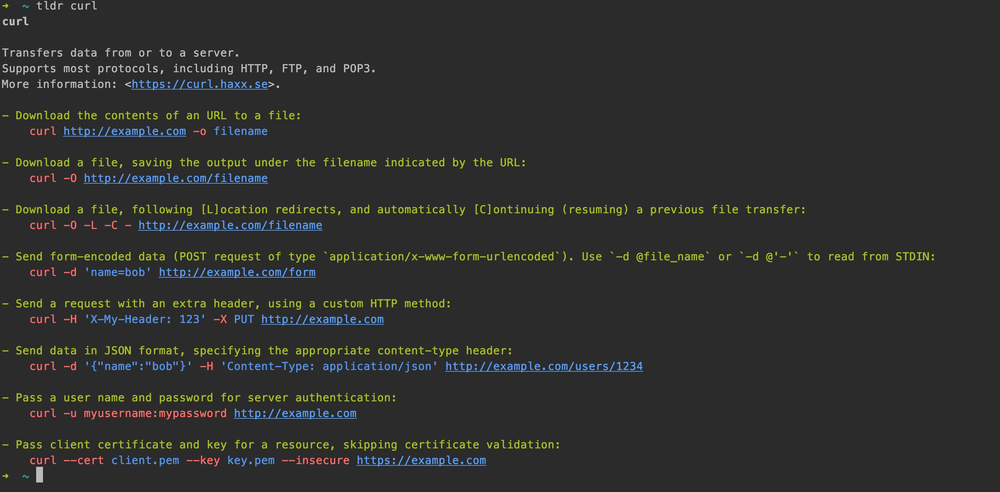
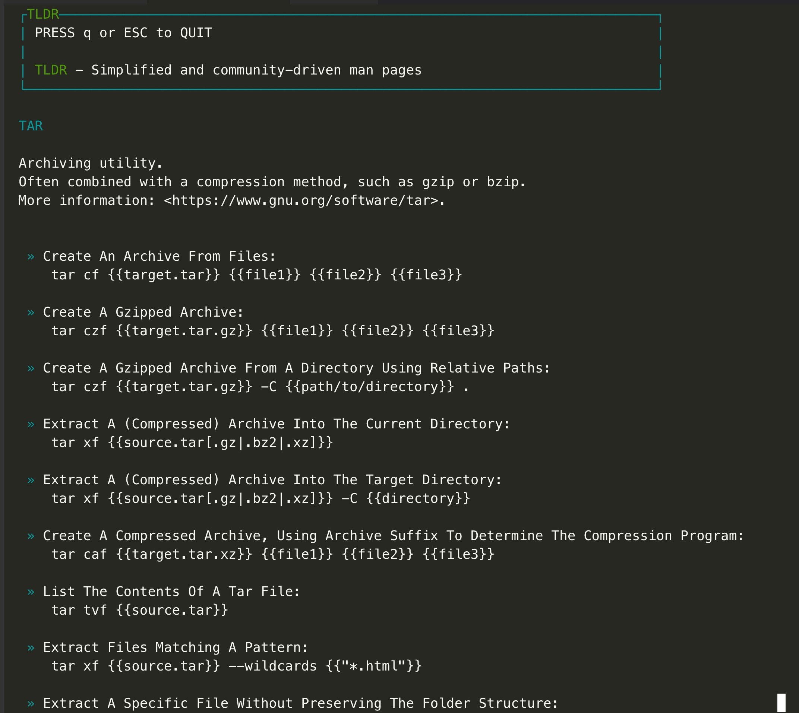
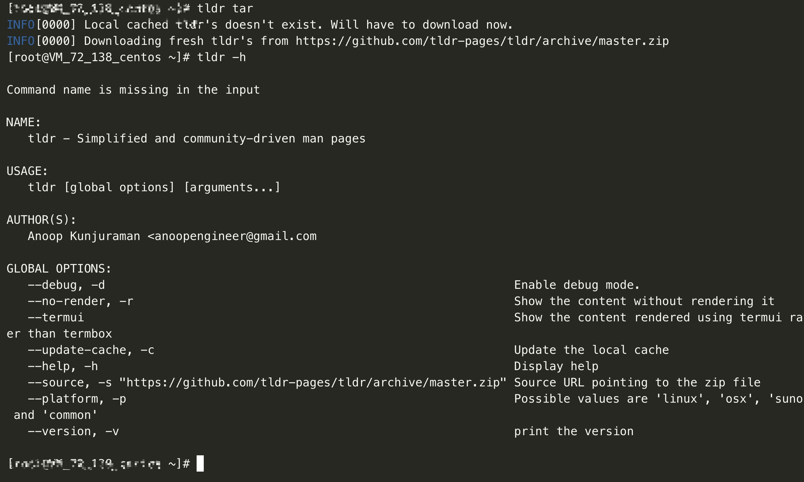

# 工具tldr客户端源代码分析

## 1.tldr工具介绍

### 1.1 **tldr：**
**全称too long,don't read,官方介绍是协同的命令行手册工具，主要通过命令行查看一些常用命令的帮助，它和man以及info帮助手册的不同在于，tldr是以一种例子、功能说明的方式来介绍常用命令，可以帮助使用者对不熟悉或者遗忘的命令进行快速的学习和掌握其用法**

官方支持的命令按照`不同操作系统特有命令、通用命令`进行分类，目前官方提供的不同操作系统特有命令，操作系统大体分为：

* windows操作系统
* linux操作系统
* mac（osx）操作系统

目前特征各个操作系统的特有命令大约分别有100+个，common通用命令有1000+个，分别来自社区不同人员的贡献。

### 1.2 tldr使用

tldr的使用非常简单，以下通过一幅图来演示  


### 1.3 tldr工具输出内容格式

该原生的命令行是通过node.js开发的，可以看到对于curl命令提供的帮助主要分为几个部分：

1. 命令名称
2. 空行
3. 命令的描述、介绍 	`Transfers data from or to a server.`
4. 具体的例子demo 
	1. 例子说明 `Download the contents of an URL to a file:`
	2. 例子code  `curl http://example.com -o filename`


## 2.tldr客户端介绍

## 3.tldr客户端源码分析

**tldr的工作原理是，将所有的命令，每个命令的使用例子和说明按照指定的markdown格式，整理成一份markdown文件，并存放在https://github.com/tldr-pages/tldr/tree/master/pages/platform/ 目录下，当需要查看帮助的命令xx的手册时，命令行客户端先去目录下找对应的xxx.md文档，找到后，然后读取该内容，并通过一定的处理方式对内容做处理，最后渲染(颜色、高亮等)，然后输出到命令行**  

**因此所有实现的tldr的客户端中，都是遵守下面的原则**

1. 首先解析得到需要帮助的命令的关键字
2. 根据命令、操作系统去组装得到帮助手册`xxx.md`的全路径
3. 读取该手册内容（markdown格式）
4. 读内容进行渲染、然后输出


### 3.1 github.com/anoopengineer/tldr 源码分析

#### 3.1.1 代码仓库地址

	https://github.com/anoopengineer/tldr.git  

#### 3.1.2 使用




	
#### 3.1.3 项目目录

``` shell
➜  ~/isacikgoz_tldr git:(master) ✗ tree .
.
├── Godeps
│   ├── Godeps.json
│   └── Readme
├── Makefile //Makefile
├── README.md //文档
├── app
│   ├── cache.go   // 缓存
│   ├── config.go  // 配置
│   ├── errors.go  // 错误定义
│   ├── execute.go // app.Execute()函数
│   ├── logging.go // 日志
│   ├── mainapp.go // NewApp
│   ├── renderer.go // 主要渲染文件
│   ├── termboxutils.go // 终端termbox渲染
│   ├── termboxwindow.go // 终端window渲染
│   ├── termuiutils.go // 终端termui渲染
│   └── tldr.go
├── screenshots
│   └── tldr-screenshot.png
├── tldr.go //main函数入口
➜  ~/isacikgoz_tldr git:(master) ✗ 
``` 

#### 3.1.4 源码分析

作者anoopengineer写的代码，思路比较清晰，tldr的入口函数如下：

**tldr.go**

``` go
func main() {
	tldr := app.MainApp(VERSION)
	tldr.Run(os.Args)
}

```

**app/mainapp.go**

```go
package app

import (
	"github.com/codegangsta/cli"
)

//主要的函数，创建一个app对象
func MainApp(version string) *cli.App {
	tldr := cli.NewApp()
	tldr.Name = "tldr"
	tldr.Author = "Anoop Kunjuraman <anoopengineer@gmail.com"
	tldr.Version = version
	tldr.Usage = "Simplified and community-driven man pages"

	tldr.Flags = []cli.Flag{
		cli.BoolFlag{
			Name:  "debug, d",
			Usage: "Enable debug mode.",
		},
		cli.BoolFlag{
			Name:  "no-render, r",
			Usage: "Show the content without rendering it",
		},
		cli.BoolFlag{
			Name:  "termui",
			Usage: "Show the content rendered using termui rather than termbox",
		},
		......
	}
	//指定命令行执行的动作
	tldr.Action = Execute
	tldr.HideHelp = true
	return tldr
}

```

**app/execute.go**

```go
import (
	"fmt"
	"io/ioutil"
	"log"
	"os"
	"strings"

	"github.com/sirupsen/logrus"
	"github.com/codegangsta/cli"
)

func getCommand() (string, error) {
	if len(os.Args) < 2 {
		return "", COMMAND_NOT_PROVIDED
	}
	command := os.Args[len(os.Args)-1]
	if strings.HasPrefix(command, "-") {
		return "", COMMAND_NOT_PROVIDED
	}
	return command, nil
}


func Execute(c *cli.Context) {
	//解析配置信息
	config := populateConfig(c)
	// 初始化日志
	InitializeLogging(config)
	LOG.WithFields(logrus.Fields{
		"config": config,
	}).Debug("Printing config")
	//1. 获取命令
	command, err := getCommand()
	if err != nil {
		fmt.Println("\nCommand name is missing in the input\n")
		cli.ShowAppHelp(c)
		return
	}

	// 检查是否需要更新缓存
	if config.UpdateCache || !localCacheAvailable() || localCacheExpired() {
		if err := updateCache(config); err != nil {
			log.Fatal(err)
		}
	}
	LOG.WithFields(logrus.Fields{
		"command": command,
	}).Debug("Printing command")
	
	//2. 根据命令获取手册的路径
	path, err := getPageLocation(command, config.Platform)

	if err == COMMAND_NOT_FOUND {
		fmt.Printf("TLDR for command %s was not found.\nYou can get your TLDRs added by sending a pull request to https://github.com/tldr-pages/tldr\n", command)
		os.Exit(-1)
	}
	if err != nil {
		LOG.Fatal(err)
	}
	LOG.WithFields(logrus.Fields{
		"path": path,
	}).Debug("Printing path")

	//3. 读取手册内容
	content, err := ioutil.ReadFile(path)
	if err != nil {
		LOG.Fatal(err)
	}

	if config.NoRender {
		fmt.Println(string(content))
	} else {
		//4. 渲染内容
		Render(config, content)
	}
}

func getCommand() (string, error) {
	if len(os.Args) < 2 {
		return "", COMMAND_NOT_PROVIDED
	}
	command := os.Args[len(os.Args)-1]
	if strings.HasPrefix(command, "-") {
		return "", COMMAND_NOT_PROVIDED
	}
	return command, nil
}


```

**app/cache.go**


```go
//根据命令关键字和操作系统获取对应的命令的手册路径
func getPageLocation(command, platform string) (string, error) {

	//获取存储的手册的路径
	currentCacheLocation, err := getCurrentCacheLocation()
	if err != nil {
		return "", err
	}
	//if platform is given, use that. If file doesn't exists return error
	// if platform is not given, try to guess the platform. if file not found, try with common.
	if platform != "" {
		//如果平台不为空，则在指定的平台目录下查找
		path := filepath.Join(currentCacheLocation, "tldr-master", "pages", platform, command+".md")
		if _, err := os.Stat(path); err != nil {
			return "", COMMAND_NOT_FOUND
		}
		LOG.WithFields(logrus.Fields{
			"path": path,
		}).Debug("Page available")
		return path, nil
	} else {
		platform = currentPlatform()
		
		path := filepath.Join(currentCacheLocation, "tldr-master", "pages", platform, command+".md")
		if _, err := os.Stat(path); err == nil {
			LOG.WithFields(logrus.Fields{
				"path":     path,
				"platform": platform,
			}).Debug("Page available")
			return path, nil
		}
		platform = "common"
		path = filepath.Join(currentCacheLocation, "tldr-master", "pages", platform, command+".md")
		if _, err := os.Stat(path); err == nil {
			LOG.WithFields(logrus.Fields{
				"path":     path,
				"platform": platform,
			}).Debug("Page available in common directory")
			return path, nil
		}
		return "", COMMAND_NOT_FOUND

	}
}
```

**app/tldr.go**

``` go

type TLDR struct {
	Name        string
	Description []string
	Items       []Example
}

type Example struct {
	Description string
	Command     []string
}

//将xx.md的内容组织成一个结构体
func NewTLDR(input []byte) TLDR {
	var tldr TLDR
	tldr.Description = make([]string, 0)
	tldr.Items = make([]Example, 0)

	lines := strings.Split(string(input), "\n")
	// LOG.WithFields(logrus.Fields{
	// 	"lines":     strings.Join(lines, "\n"),
	// 	"lines_len": len(tldr.Items),
	// }).Debug("Splitted the data into individual lines")

	for _, v := range lines {
		v = strings.TrimSpace(v)
		if v == "" {
			continue
		}
		if strings.HasPrefix(v, "#") {
		 // 标题，也就是命令
			tldr.Name = strings.TrimSpace(strings.TrimPrefix(v, "#"))
			LOG.WithFields(logrus.Fields{
				"tldr": tldr,
			}).Debug("Got Name")
		} else if strings.HasPrefix(v, ">") {
			//描述
			desc := strings.TrimSpace(strings.TrimPrefix(v, ">"))
			tldr.Description = append(tldr.Description, desc)
			LOG.WithFields(logrus.Fields{
				"tldr": tldr,
			}).Debug("Got Description")
		} else if strings.HasPrefix(v, "-") {
			//例子说明
			var ex Example
			ex.Command = make([]string, 0)
			ex.Description = strings.TrimSpace(strings.TrimPrefix(v, "-"))
			LOG.WithFields(logrus.Fields{
				"ex":        ex,
				"items_len": len(tldr.Items),
			}).Debug("Adding example")
			tldr.Items = append(tldr.Items, ex)
			LOG.WithFields(logrus.Fields{
				"tldr": tldr,
			}).Debug("Got Command Description")
		} else if strings.HasPrefix(v, "`") {
			//code
			command := strings.TrimPrefix(v, "`")
			command = strings.TrimSuffix(command, "`")
			command = strings.TrimSpace(command)
			lastItemIndex := len(tldr.Items) - 1
			lastItem := tldr.Items[lastItemIndex]
			lastItem.Command = append(lastItem.Command, command)
			tldr.Items[lastItemIndex] = lastItem
			LOG.WithFields(logrus.Fields{
				"tldr": tldr,
			}).Debug("Got Command")
		} else {
			LOG.WithFields(logrus.Fields{
				"line": v,
			}).Error("Got unknown line")
		}

	}
	return tldr
}

```


**app/renderer.go**

``` go
const WIDTH = 80

func Render(config Config, input []byte) error {
	tldr := NewTLDR(input)
	LOG.WithFields(logrus.Fields{
		"tldr": tldr,
	}).Debug("Printing tldr")

	if config.RenderOnTermUI {
		//termui 渲染
		return RenderOnTermUI(tldr)
	} else {
		//termbox 渲染
		return RenderOnTermbox(tldr)
	}
}

``` 

**app/termuiutils.go**

```go
//渲染内容
func RenderOnTermUI(tldr TLDR) error {
	err := termui.Init()
	if err != nil {
		return err
	}
	defer termui.Close()

	buffers := make([]termui.Bufferer, 0)

	yOffset := 0
	header := termui.NewPar(" PRESS q or ESC TO QUIT\n\n[TLDR](fg-green) - Simplified and community-driven man pages")
	header.Height = 5
	header.Width = WIDTH
	header.TextFgColor = termui.ColorWhite
	header.BorderLabel = "TLDR"
	header.BorderFg = termui.ColorCyan
	header.Y = yOffset
	yOffset += (header.Height + 1)
	buffers = append(buffers, header)

	tldrName := termui.NewPar("[" + strings.ToUpper(tldr.Name) + "](fg-cyan)")
	tldrName.Height = 1
	tldrName.Width = WIDTH
	tldrName.TextFgColor = termui.ColorWhite
	tldrName.Border = false
	tldrName.Y = yOffset
	yOffset += (tldrName.Height + 1)
	buffers = append(buffers, tldrName)

	tldrDesc := termui.NewPar(strings.Join(tldr.Description, "\n"))
	tldrDesc.Height = len(tldr.Description)
	tldrDesc.Width = WIDTH
	tldrDesc.TextFgColor = termui.ColorWhite
	tldrDesc.Border = false
	tldrDesc.Y = yOffset
	yOffset += (tldrDesc.Height + 1)
	buffers = append(buffers, tldrDesc)

	for _, item := range tldr.Items {
		commandDesc := termui.NewPar(" [*](fg-cyan) " + strings.Title(item.Description))
		commandDesc.Height = getNumberOfLines([]byte(item.Description))
		commandDesc.Width = WIDTH
		commandDesc.TextFgColor = termui.ColorWhite
		commandDesc.Border = false
		commandDesc.Y = yOffset
		yOffset += (commandDesc.Height)
		buffers = append(buffers, commandDesc)

		for _, c := range item.Command {
			command := termui.NewPar(c)
			command.Height = getNumberOfLines([]byte(c))
			command.Width = WIDTH - 4
			command.TextFgColor = termui.ColorWhite
			command.Border = false
			command.Y = yOffset
			command.X = 4
			yOffset += (command.Height)
			buffers = append(buffers, command)
		}
		yOffset++
	}

	termui.Render(buffers...) // feel free to call Render, it's async and non-block
	// for _, v := range buffers {
	// 	termui.Body.AddRows(termui.NewRow(termui.NewCol(12, 0, v)))
	// }
	// termui.Body.Align()
	// termui.Render(termui.Body)

	termui.Handle("/sys/kbd/q", func(termui.Event) {
		termui.StopLoop()
	})
	termui.Handle("/sys/kbd/C-c", func(termui.Event) {
		termui.StopLoop()
	})
	termui.Handle("/sys/kbd/<escape>", func(termui.Event) {
		termui.StopLoop()
	})
	......
	termui.Handle("/sys/wnd/resize", func(e termui.Event) {
		termui.Body.Width = termui.TermWidth()
		termui.Body.Align()
		termui.Render(termui.Body)
	})
	termui.Loop()
	return nil
}


//zip解压文件
func unzip(src, dest string) error {
	r, err := zip.OpenReader(src)
	if err != nil {
		return err
	}
	defer func() {
		if err := r.Close(); err != nil {
			panic(err)
		}
	}()

	os.MkdirAll(dest, 0755)

	// Closure to address file descriptors issue with all the deferred .Close() methods
	extractAndWriteFile := func(f *zip.File) error {
		rc, err := f.Open()
		if err != nil {
			return err
		}
		defer func() {
			if err := rc.Close(); err != nil {
				panic(err)
			}
		}()

		path := filepath.Join(dest, f.Name)

		if f.FileInfo().IsDir() {
			os.MkdirAll(path, f.Mode())
		} else {
			f, err := os.OpenFile(path, os.O_WRONLY|os.O_CREATE|os.O_TRUNC, f.Mode())
			if err != nil {
				return err
			}
			defer func() {
				if err := f.Close(); err != nil {
					panic(err)
				}
			}()

			_, err = io.Copy(f, rc)
			if err != nil {
				return err
			}
		}
		return nil
	}

	for _, f := range r.File {
		err := extractAndWriteFile(f)
		if err != nil {
			return err
		}
	}

	return nil
}


```

**app/cache.go**


```go
//更新缓存
func updateCache(config Config) error {
	LOG.Info("Downloading fresh tldr's from " + config.SourceURL)
	//获取当前缓存路径
	currentCacheLocation, _ := getCurrentCacheLocation() // May be nil
	LOG.Debug("Current cache location is " + currentCacheLocation)
	//获取新的缓存路径
	newCacheLocation := getNewCacheLocation()
	LOG.Debug("New cache location is " + newCacheLocation)

	//下载压缩文件
	zipLocation := filepath.Join(newCacheLocation, "master.zip")
	out, err := os.Create(zipLocation)
	if err != nil {
		LOG.Fatal(err)
	}
	defer out.Close()
	resp, err := http.Get(config.SourceURL)
	if err != nil {
		LOG.Fatal(err)
	}
	defer resp.Body.Close()
	io.Copy(out, resp.Body)
	LOG.Debug("Download complete")
	//zip解压
	if err := unzip(zipLocation, newCacheLocation); err != nil {
		LOG.Fatal(err)
	}
	os.Remove(zipLocation)
	LOG.Debug("Unzip completed")

	//NOW update the cache.json with the new path and delete the old path
	// if everything was successfull so far
	newCache := Cache{
		LastUpdateDate: time.Now(),
		CacheLocation:  newCacheLocation,
	}
	err = updateCacheMetaData(newCache)
	if err != nil {
		LOG.Fatal(err)
	}
	if currentCacheLocation != "" {
		os.RemoveAll(currentCacheLocation)
	}
	return nil
}


```

#### 3.1.5 收获

1. 学到了tldr的原理和设计思路
2. 学到了一种golang的命令行库[cli](https://github.com/codegangsta/cli)
3. 学到了终端渲染的工具类库[termui](https://github.com/gizak/termui)和[termbox](https://github.com/nsf/termbox-go)
4. zip文件解压方法


### 3.2 github.com/isacikgoz/tldr 源码分析

#### 3.2.1 isacikgoz/tldr仓库地址

	http://github.com/isacikgoz/tldr.git 

#### 3.2.2 源码分析
待补充...

### 3.3 github.com/raylee/tldr-sh-client 源码分析

#### 3.3.1 raylee/tldr-sh-client仓库地址

	https://github.com/raylee/tldr-sh-client.git 

#### 3.3.2 源码分析
待补充...

## 4.增加、贡献相关的命令

1. 在https://github.com/tldr-pages/tldr/tree/master/pages/platform/ 目录下按照指定的格式编写对应的md文件(描述、例子、code)，然后就可以直接使用了，so easy


## 5.参考资料

1. [anoopengineer/tldr项目地址](https://github.com/anoopengineer/tldr)
2. [tldr shell client项目地址](https://github.com/raylee/tldr-sh-client)
3. [isacikgoz/tldr tldr++项目地址](https://github.com/isacikgoz/tldr)
2. [Collaborative cheatsheets for console commands](https://github.com/tldr-pages/tldr)
3. [tldr client wiki](https://github.com/tldr-pages/tldr/wiki/tldr-pages-clients)
4. [tldr pages](https://tldr.sh/)


